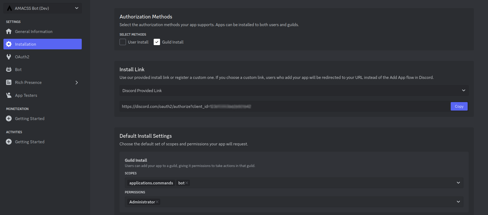
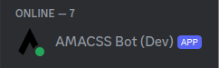

<div align="center">
  <a href="https://discord.com" target="_blank">
      
  </a>
  <a href="https://amacss.org/" target="_blank">
      
  </a>

  <h1>AMACSS Discord Bot</h1>

  <p>
    This is the repository for the AMACSS open source Discord bot. By contributing to this bot, you can learn about open-source contribution while developing your Python skills.
  </p>
</div>

## Prerequisites

- Git
- Python 3.8+
- Pip
- A Discord account

## Table of Contents

1. [Prerequisites](#prerequisites)
2. [Discord Developer Portal](#discord-developer-portal)
3. [Setting up the Project](#setting-up-the-project)
4. [Adding Bot To Local Server](#adding-bot-to-local-server)
5. [Creating Commands](#creating-commands)
6. [Submitting a Contribution](#submitting-a-contribution)
7. [Ideas](#ideas)

## Discord Developer Portal

(1) Navigate to the <a href="https://discord.com/developers/applications">Discord Developer Portal</a> and authenticate using your Discord credentials.

(2) On the Applications dashboard page, click `New Application` and give a name of your choice:


(3) Navigate to the `Bot` tab, and in the token section, click `Reset Token`. You should see a new token:


(4) Copy the token and store it for future use.

(5) On the `Bot` tab, make sure all of the `Privileged Gateway Intents` are enabled as shown:


## Setting up the Project

<b>(1) Fork the repository:</b>

You won't have permission to commit changes directly to this repository (as with most open source projects). The common way to make a contribution is to fork the repository (create a copy that you have ownership of), make your changes on the fork, and submit a `pull request`, which requests for the changes on your copy to be merged to the original repository.

Press the `fork` button


Click `Create fork`, ensuring "Copy the dev branch only" is selected


<b>(2) Clone the repository:</b>

On your forked repository, click the green `Code` button to find the clone URL:


Copy the url, navigate to your terminal, and run the following commands:
```
git clone [CLONE_URL] # Replace [CLONE_URL] with your clone URL
cd amacss_bot
```

Note: Cloning with either SSH or HTTPS is fine
Note 2: If you get an error while cloning, you may need to create an [SSH key](https://docs.github.com/en/authentication/connecting-to-github-with-ssh/generating-a-new-ssh-key-and-adding-it-to-the-ssh-agent): 

<b>(3) Discord Token:</b>

In the base project directory, create a file named `.env`

Inside `.env`, place the following lines:

```
DISCORD_TOKEN=[YOUR_DISCORD_TOKEN]  # Replace [YOUR_DISCORD_TOKEN] with your bot token from earlier
DATABASE_URL=sqlite:///database.db
```

<b> (4) Create a virtual environment: </b>

```
python -m venv venv
```

Note 1: If "python" doesn't work for the command above, try "python3"

Note 2: Please name your virtual environment `venv` (as done above) - if you decide to use a different name, add it to .gitignore

<b>(5) Activate your venv:</b>

```
source venv/bin/activate
```

Note: For windows devices, the command might differ. You typically just enter the path of the `activate` script that is within your `venv` folder. For me, it's:

```
./venv/bin/activate     # I've also seen ./venv/Scripts/activate
```

Note 2: To deactivate your venv, use the command:

```
deactivate
```

<b>(6) Install necessary packages:</b>

```
pip install -r deps.txt
```

Note: If "pip" doesn't work for the command above, try "pip3"

<b>(7) Run database migrations:</b>

The bot uses a `sqlite` database for certain commands (eg; storing player info for the `/fishing` command). In order to run the bot locally, you'll need to make use of migrations, which will sync your local database schema with the modifications made by previous contributors. Simply run the following command:

```
alembic upgrade head
```


<b>(8) Run The Bot:</b>

Run the following command:

```
python main.py
```

You should see an output command similar to the following (the bot name may differ):

```
We have logged in as AMACSS Bot (Dev)#3613
```

Note: If you get issues

## Adding Bot To Local Server

To test out our new features, we will want to create our own server so we can add the local copy of the bot we created:

(1) Make a Discord server

(2) On the <a href="https://discord.com/developers/applications">Discord Developer Portal</a>, get the installation link and set the install settings as follows:



(3) Paste the install link into a browser, and add it to your server:


(4) If you completed "(6) Run the Bot" from the previous section, the bot should appear to be online in your server:



Now you can try out the bots commands and test your own creations!

## Creating Commands

`discord.py` uses [Cogs](https://discordpy.readthedocs.io/en/stable/ext/commands/cogs.html) to group related commands together within Python classes. There are 2 options for adding a command:

<b>(a) Your new command can be added to an existing cog</b>

For example, if adding a `/hunt` command, you can add a `hunt` function to the Economy cog (`/cogs/games/economy.py`) since it's similar to `/fish` and other commands related to the economy feature. 

This would look like the following:

```python
...

class Economy(commands.Cog):
    ...
    @app_commands.command(name='hunt', description='Hunt for food!')
    async def hunt(self, interaction: discord.Interaction):
      # Your logic here
```


<b>(b) You need to create a new cog to place the command</b>

If you're creating a completely new type of command, you'll need to create a new file under `cogs/[CATEGORY]/[COG_NAME].py`. In this example, we'll create a simple `/ping` command. The steps are as followed:

(1) Create your cog:

```python
# cogs/generic/ping.py
import discord
from discord.ext import commands
from discord import app_commands

class Ping(commands.Cog):
    def __init__(self, bot):
        self.bot = bot

    @commands.Cog.listener()
    async def on_ready(self):
        print('Ping cog is ready')'

    # YOUR COMMAND(S) HERE
  
async def setup(bot):
    await bot.add_cog(Ping(bot))
```

The `on_ready` function will tell us that we've successfully loaded the cog when we try and start the bot. The setup function is used by our bot to lead all the commands into Discord. Read the documentation for more info.

(2) Navigate to `cog_loader.py`, and add the `module path` to your cog inside the `cogs` array. This is typically the relative path to your cog, but with `.` instead of `/` and no `.py` file extension. In our case, it's `cogs.generic.ping`, so we add the following:

```python
async def cog_loader(bot):
    # MUST ADD YOUR COGS HERE FOR YOUR COMMANDS TO WORK
    cogs = [
      ...
      "cogs.generic.ping",
    ]
    ...
```

Refer to the [documentation](https://discordpy.readthedocs.io/en/stable/index.html) to learn things like sending a message back to the user, what `discord.Interaction` is, sending embeds, etc.

Note: Discord.py doesn't have <i>Hot Module Reloading</i>, so whenever you make a change you will need to stop your bot (Ctrl-C) and restart with `python main.py`.

<b>Creating commands that interact with a database:</b>

This bot uses [SQLAlchemy](https://www.sqlalchemy.org/) as an ORM to interact with our `sqlite` database. If you require an additional DB table for your command, you will need to do the following:

(1) Make a <i>model</i> representing that table. For example, for our economy game we have created the following 2 tables in `models/economy.py`:

```python
from sqlalchemy import Column, Integer, String, ForeignKey
from sqlalchemy.orm import relationship
from .base import Base

class EconomyPlayer(Base):
    __tablename__ = 'economy_player'

    id = Column(Integer, primary_key=True)
    discord_id = Column(String, nullable=False, unique=True)
    discord_name = Column(String, nullable=False)
    balance = Column(Integer, default=0)
    inventory = relationship('Inventory', back_populates='player', cascade='all, delete-orphan')

class Inventory(Base):
    __tablename__ = 'economy_inventory'

    id = Column(Integer, primary_key=True)
    player_id = Column(Integer, ForeignKey('economy_player.id'))
    item_name = Column(String, nullable=False)
    item_type = Column(String, nullable=False)
    quantity = Column(Integer, default=1)
    player = relationship('EconomyPlayer', back_populates='inventory')
```

(2) Import your new classes into `models/__init__.py`:
```python
# models/__init__.py
...
from .economy import EconomyPlayer, Inventory
...
```

(3) Import your new classes into `alembic/env.py`:
```python
# alembic/env.py
...
from models.economy import EconomyPlayer, Inventory
...
```

(4) Run `alembic revision --autogenerate -m [DESCRIPTION]` to create a migration, which will sync your database with your new schema. For example, we ran `alembic revision --autogenerate -m "Create economy tables"` to create the economy tables.

(5) Run `alembic upgrade head` to run the latest migration.

(6) Put your logic in your command to interact with your database using SQLAlchemy. `cogs/games/economy.py` is a good example showing the various things you can do.

Note: You can use [DB Browser](https://sqlitebrowser.org/) as a tool to view your `database.db` file that you should see in your root folder. This will help you verify that your migrations are working, and also that your data is being inserted correctly as you work on your command.

<b>Creating commands that require an API key:</b>

If utilizing a 3rd-party library that requires an API key, put the link to where you can create the API key in your pull request.

Note: Any 3rd-party library utilized must be free (eg; cannot use the OpenAI API)

Note 2: If you utilize any library installed through `pip` that wasn't already in `deps.txt`, please add it to `deps.txt`

## Submitting a Contribution

[TODO]

## Ideas

[TODO]