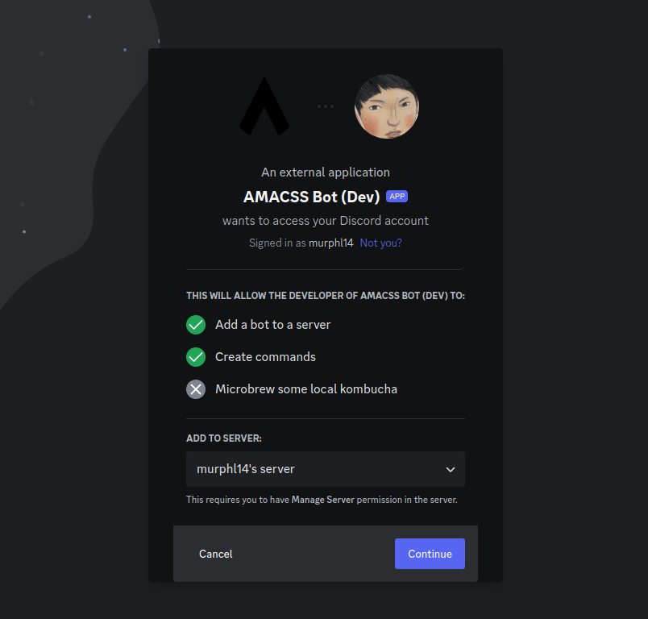

<div align="center">
  <a href="https://discord.com" target="_blank">
      
  </a>
  <a href="https://amacss.org/" target="_blank">
      
  </a>

  <h1>AMACSS Discord Bot</h1>

  <p>
    This is the repository for the AMACSS open source Discord bot. By contributing to this bot, you can learn about open-source contribution while developing your Python skills.
  </p>
</div>

## Prerequisites

- Git
- Python 3.6-3.10
- Pip
- A Discord account


## Discord Developer Portal

(1) Navigate to the <a href="https://discord.com/developers/applications">Discord Developer Portal</a> and authenticate using your Discord credentials.

(2) On the Applications dashboard page, click "New Application" and give a name of your choice:


(3) Navigate to the "Bot" tab, and in the token section, click "Reset Token". You should see a new token:


(4) Copy the token and store it for future use.

## Setting up the Project

<b>(1) Clone the repository:</b>
```
git clone git@github.com:amacss-utsc/amacss_bot.git
cd amacss_bot
```

Note: Cloning with either SSH or HTTPS is fine

<b>(2) Discord Token:</b>

In the base project directory, create a folder named ".env"

Inside .env, place the following line:

```
DISCORD_TOKEN=INSERT  # Replace INSERT with your bot token from earlier
```

<b> (3) Create a virtual environment: </b>

```
python -m venv venv
```

Note 1: If "python" doesn't work for the command above, try "python3"

Note 2: Please name your virtual environment "venv" (as done above) - if you decide to use a different name, add it to .gitignore

<b>(4) Activate your venv:</b>
```
source venv/bin/activate
```

Note: To deactivate your venv, use the command:
```
deactivate
```

<b>(5) Install necessary packages:</b>
```
pip install -r deps.txt
```

Note: If "pip" doesn't work for the command above, try "pip3"

<b>(6) Run The Bot:</b>

Run the following command:

```
python main.py
```

You should see an output command similar to the following (the bot name may differ):

```
We have logged in as AMACSS Bot (Dev)#3613
```

## Adding Bot To Local Server

To test out our new features, we will want to create our own server so we can add the local copy of the bot we created:

(1) Make a Discord server

(2) On the <a href="https://discord.com/developers/applications">Discord Developer Portal</a>, get the installation link and set the install settings as follows:


(3) Paste the install link into a browser, and add it to your server:



(4) If you completed "(6) Run the Bot" from the previous section, the bot should appear to be online in your server:


Now you can try out the bots commands and test your own creations!

Todo: Exec vs Common, libraries, pull requesting